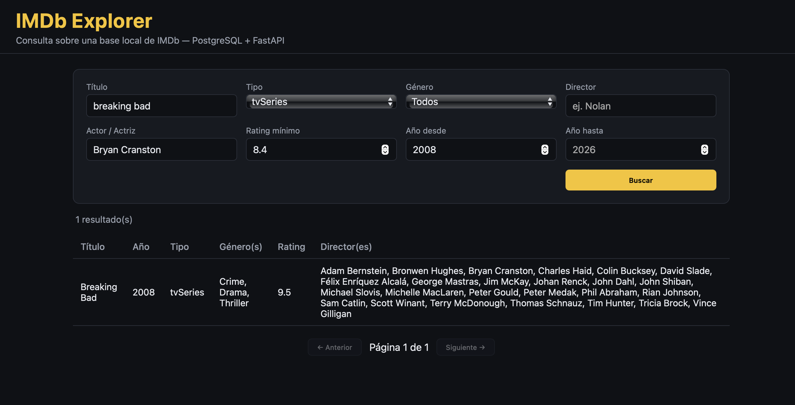

# IMDb Explorer

Sitio web para consultar IMDb con filtros por título, tipo, género,
director, actor/actriz, rating mínimo y rango de años. Proyecto de
portafolio: backend en FastAPI con SQL dinámico sobre PostgreSQL (alojado
gratis en Neon), frontend en HTML/JS plano, empaquetado en Docker.



## Qué hace

- Búsqueda de títulos con coincidencia parcial por nombre.
- Filtros combinables: tipo de título, género, director, actor/actriz,
  rating mínimo, rango de años.
- Resultados paginados.
- Vista de detalle por título: sinopsis básica, reparto principal,
  director(es) y guionista(s).

## Stack

| Capa        | Tecnología                                       |
|-------------|---------------------------------------------------|
| Backend     | FastAPI (Python), consultas SQL dinámicas          |
| Driver DB   | psycopg 3 + psycopg_pool (pool de conexiones)      |
| Base        | PostgreSQL en Neon (plan gratuito, ~340 MB)         |
| Frontend    | HTML + CSS + JavaScript vanilla                    |
| Empaquetado | Docker / docker-compose (servicio `web`)           |

## Cómo levantarlo

La base no vive en tu computadora: se aloja en [Neon](https://neon.tech)
(plan gratuito, 0.5 GB) y se llena directamente desde los datasets
públicos de IMDb, sin descargar nada a disco.

1. Crea una cuenta y un proyecto en Neon y copia la cadena de conexión
   (*Dashboard → Connect*).
2. Configura el proyecto:

   ```bash
   git clone https://github.com/danielhdzr/imdb-explorer.git
   cd imdb-explorer
   cp .env.example .env      # pega ahí tu DATABASE_URL
   python3 -m venv venv && venv/bin/pip install -r requirements.txt
   ```

3. Carga los datos (una sola vez, ~15–30 min según tu conexión):

   ```bash
   set -a; source .env; set +a
   venv/bin/python cargar_datos.py
   ```

4. Levanta el sitio, con Docker o directo:

   ```bash
   docker compose up -d --build
   # o bien: venv/bin/uvicorn main:app --env-file .env
   ```

El sitio queda en **http://localhost:8000**.

> **Sobre los datos**: para caber en el plan gratuito se cargan los
> títulos con al menos 200 votos (~170k: todas las películas y series
> conocidas), sin episodios sueltos de series ni títulos alternativos.
> El umbral se cambia con `--min-votos`. Detalles en
> [DOCUMENTACION.md](DOCUMENTACION.md).

## Documentación técnica

Esquema de la base, diseño de los endpoints, cómo se arman las consultas
con filtros dinámicos, y las decisiones de diseño del proyecto están en
[DOCUMENTACION.md](DOCUMENTACION.md).

## Estructura del proyecto

```
imdb-explorer/
├── Dockerfile
├── docker-compose.yml
├── .env.example
├── cargar_datos.py      # carga IMDb → Postgres en streaming
├── main.py              # API FastAPI + montaje del frontend estático
├── requirements.txt
├── screenshots/
│   └── busqueda.png
└── static/
    ├── index.html
    ├── style.css
    └── app.js
```
